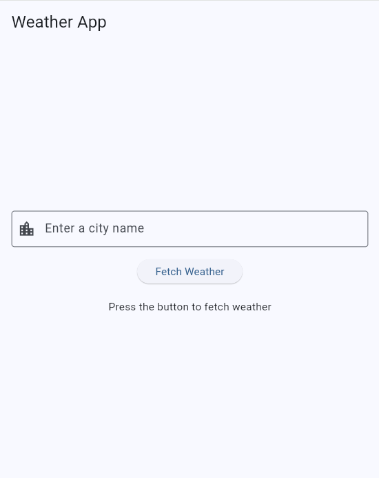
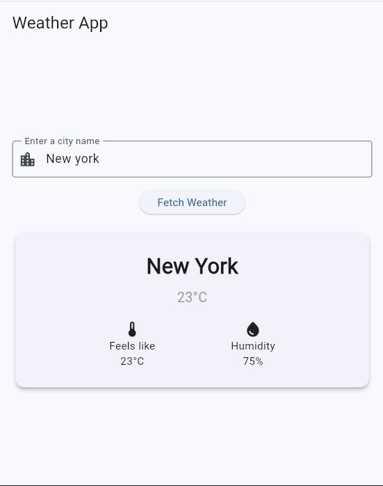

# Weather App

A clean weather application built with Flutter. Enter a city name to get its current weather conditions, fetched in real time from the OpenWeatherMap API.

## Screenshot




## Features

- Search weather by city name
- Real-time data from the OpenWeatherMap API
- Displays temperature, "feels like", humidity, and conditions
- Loading indicator while fetching data
- Graceful error handling (invalid city, no internet connection)

## Tech Stack

- **Flutter** (Dart 3)
- **http** package for API requests
- **OpenWeatherMap API** for weather data
- Asynchronous programming with `async`/`await`
- JSON parsing into a typed model
- Layered architecture (model / service / UI separation)

## Project Structure

lib/

├── models/

│   └── weather.dart            # Weather data model with JSON parsing

├── services/

│   └── weather_service.dart    # Handles API requests and error throwing

├── screens/

│   └── weather_home_page.dart  # UI and state management

├── secrets.dart                # API key (not committed to Git)

└── main.dart                   # App entry point

## Getting Started

Make sure you have the [Flutter SDK](https://docs.flutter.dev/get-started/install) installed.

1. Clone the repository:
```bash
   git clone https://github.com/rdagli97/weather_app.git
   cd weather_app
```
2. Install dependencies:
```bash
   flutter pub get
```
3. Get a free API key from [OpenWeatherMap](https://openweathermap.org/api).
4. Create a file at `lib/secrets.dart` with the following content:
```dart
   const String openWeatherApiKey = 'YOUR_API_KEY_HERE';
```
5. Run the app:
```bash
   flutter run
```

## What I Learned

This project was built to learn how to work with external APIs in Flutter, including:

- Making HTTP requests with the `http` package
- Handling asynchronous operations with `async`/`await` and `Future`
- Parsing JSON responses into a typed Dart model
- Separating concerns with a dedicated service layer
- Managing loading and error states in the UI
- Keeping API keys secure and out of version control with `.gitignore`